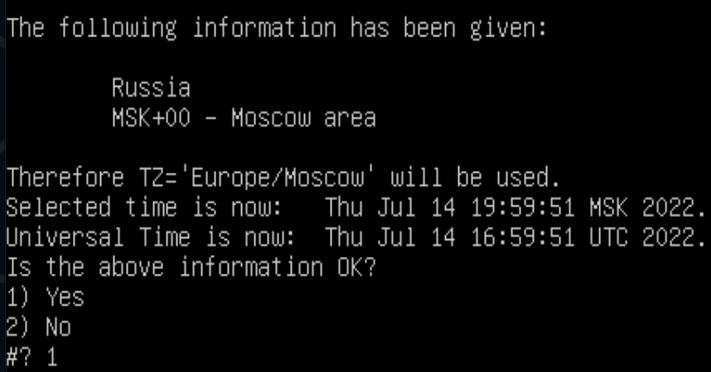
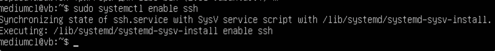
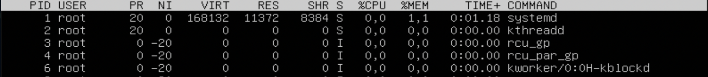
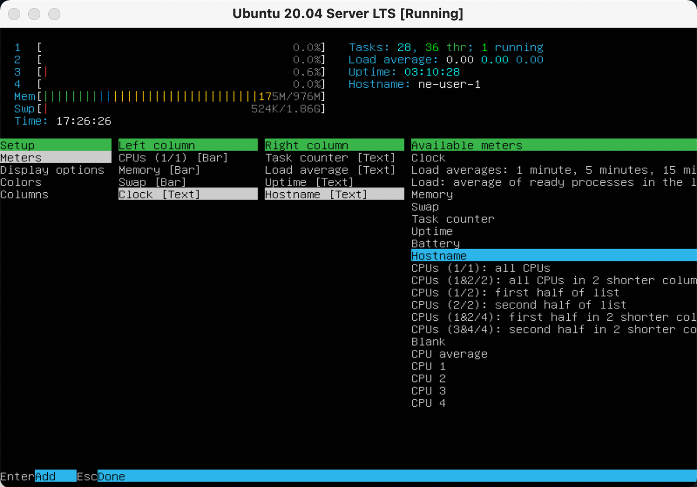
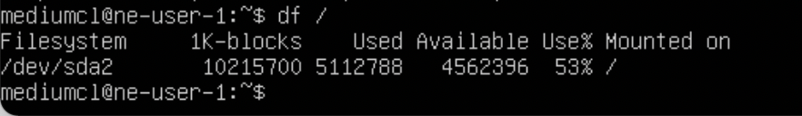

## Операционные системы UNIX/Linux (Базовый).

## Part 1. Установка ОС.
* Устанавливаем [Ubuntu-20.04-Server-LTS](https://old-releases.ubuntu.com/releases/20.04.0/ubuntu-20.04-live-server-amd64.iso) , [инструкция](https://linuxconfig.org/how-to-install-ubuntu-20-04-on-virtualbox) в VirtualBox и проверяем установленную версию командой:

  `cat /etc/issue` ;

## Part 2. Создание пользователя.

* 1. Cоздаем пользователя командой: 

 `sudo adduser (username)` ;        

 
 [Более подробная информация по утилите adduser](https://www.opennet.ru/man.shtml?topic=adduser&category=8&russian=0)
* 2. Добавляем права для пользователя с помощью команды: 

  `sudo useradd -G adm -p (password) -s /bin/bash (username)` ;

[Более подробная информация по утилите useradd](https://www.opennet.ru/man.shtml?topic=useradd&category=8&russian=0).

* 3. Проверяем правильность выполненных действий командой:

  `cat /etc/passwd` ;

## Part 3. Настройка сети ОС.

* 1. Задаём название машины:

  `sudo hostnamectl set-hostname user-1` ;

* 2. Задаем время, нам нужно Московское:

  `tzselect` ;

* Выбираем Европу, затем Россию, затем Москву:

 
* Подтверждаем:

* Способ 2:

  `sudo timedatectl set-timezone Europe/Moscow 
  sudo date`

* 3. Выясняем внешний **ip-адрес** , **ip-адрес** устройства , внутренний **ip-адрес** шлюза(**gw**) , а также выводим названия сетевых интерфейсов.
* Адрес устройства:

  ` hostname -I ` ;
     
    
* Внешний адрес:
 ` curl 2ip.ru ` ;

* gw:
`ip r | grep def | grep -Eo '[0-9.]*' | head -n 1`;

* Названия сетевых интерфейсов:
` ifconfig ` ;

         

* 4. Ликбез по сетевым интерфейсам.

* **lo** - интерфейс обратной петли (loopback) позволяет компьютеру обращатся к самому себе. Интерфейс имеет ip-адрес 127.0.0.1 и может быть использован сетевым клиентским программным обеспечением, чтобы общаться с серверным приложением, расположенным на том же компьютере.
 * **DHCP (Dynamic Host Configuration Protocol)** — протокол прикладного уровня модели TCP/IP, служит для автоматизации назначения IP-адреса клиенту. Сервер всегда слушает 67 порт, ожидает широковещательное сообщение от клиента, а после его получения отправляет ответное предложение — DHCPOFFER. Клиент принимает сообщение на 68 порту.

*  Задаем статичные настройки **ip, gw, dns** в файле конфигурации netplan:

* Сперва вводим команду:

    

  ` nano /etc/netplan/00-installer-config.yaml `;
* Откроется nano:

* Туда вставляем следующий текст для изменения сетевых конфигураций на нужные нам:

* Подтвержлаем конфигурации:

* Перезагружаем машину:

* Пингуем `1.1.1.1` и `ya.ru`:

## Part 4. Обновление ОС.

* Начинаем процесс обновления командой `sudo apt-get update` для обновления информации о пакетах;

* Далее `sudo apt-get dist-upgrade` - обновление версии;

## Part 5. Использование команды sudo.

* Команда **sudo** ( substitute user and do, подменить пользователя и выполнить ) позволяет строго определенным пользователям выполнять указанные программы с административными привилегиями без ввода пароля суперпользователя root.

* Кажется пользователю **van**, который пришел к нам в **Part 2** стало грустно от его беспомощности, но мы можем это исрпавить с помощью команды: `sudo usermod -aG sudo van`;

* Вводим команду: `su - van`, чтобы перейти на учетную запись **van**;

* И вот, почувствовав вседозволенность, **van** решает сменить название хоста командой: `sudo -u van sudo hostnamectl set-hostname ne-user-1` ;

* Проверим командой `hostname`, получилось ли у него?

* Кажется да!

## Part 6. Установка и настройка службы времени.

* Вообще дату и время мы установили еще в **Part 2** , но давайте проверим правильность установленного времени с помощью команд:

`date;
 timedatectl show;`

* Успех!

## Part 7. Установка и использование текстовых редакторов.
* Основная цель задания - Установить текстовые редакторы VIM (+ любые два по желанию NANO, MCEDIT, JOE и т.д.)
Используя каждый из трех выбранных редакторов, создайте файл test_X.txt, где X -- название редактора, в котором создан файл. Напишите в нём свой никнейм, закройте файл с сохранением изменений.

* 1. NANO:
  * `nano test_nano.txt`;
  * Введите свй ник (**mediumcl**);

  
  * Нажмите **Cmd+O**, **Enter** для сохранения и **Cmd+X** для выхода;
  * `nano test_nano.txt`;
  * Нажимте **Cmd+\\**, введите строку, которую необходимо искать (**mediumcl**);

  
  *  и нажмите клавишу **Enter**. Затем введите строку, на которую произвести замену (**21 School 21**) и нажмите **Enter**; 

  
  * нажмите клавишу **A** для замены всех вхождений строки;

  
  * Нажмите **Cmd+X** для выхода;
  * Нажмите **N** для выхода без сохранения изменений;

  

* 2. Vim:
  * `vim test_vim.txt`;
  * Введите свй ник (**mediumcl**);

  
  * Для выхода с сохранением нажмите **ESC** , затем введите **:wq!**. Для подтверждения нажмите **Enter**;

  
  * `vim test_vim.txt`;
  * Меняем (**mediumcl**) на (**21 School 21**);
  Замена в **vim** -  **ESC** **:%s/"слово"/"замена слово"**;

  
  * Для выхода без сохранения нажимаем **ESC** , **SHIFT + вводим q!**. Для подтверждения нажмите **Enter**;

  

* 3. JOE:
  * Устанавливаем JOE `sudo apt install joe`;
  * `joe test_joe.txt`;
  * Введите свй ник (**mediumcl**);
  * Для выхода с сохранением нажмите **ctrl+K+X** , затем введите **y**. Для подтверждения нажмите **Enter**;

  
  * `joe test_joe.txt`
  * Меняем (**mediumcl**) на (**21 School 21**);
  Замена в **joe** -  **ctrl+G** - для поиска слова, подтверждааем на **Enter**, нажимаем **R** для замены,вводим нужное слово и подтверждааем на **Enter**, вводим **y**, чтобы подтвердить;

  
  
  
  
  
  * Для выхода без сохранения нажмите **ctrl+C** , затем введите **y**. Для подтверждения нажмите **Enter**;

  

## Part 8. Установка и базовая настройка сервиса SSHD.
* Устанавливаем и настраиваем SSH-сервер с помощью команд:

      `sudo apt-get update &&
      sudo apt-get install openssh-server net-tools && 
      sudo systemctl enable ssh &&  # добавляем сервер в автозапуск
      sudo sed -i '/Port/c\Port 2022' /etc/ssh/sshd_config &&  # изменяем порт
      sudo systemctl restart sshd;
      clear;
      ps -C sshd;
      netstat -tan;`

      

* Опции утилиты **ps**:
  * -A, -e - выбрать все процессы;
  * -a - выбрать все процессы, кроме фоновых;
  * -d - выбрать все процессы, даже фоновые, кроме процессов сессий;
  * -N - выбрать все процессы кроме указанных;
  * -С - выбирать процессы по имени команды;
  * -G - выбрать процессы по ID группы;
  * -p - выбрать процессы PID;
  * --ppid - выбрать процессы по PID родительского процесса;
  * -s - выбрать процессы по ID сессии;
  * -t - выбрать процессы по tty;
  * -u - выбрать процессы пользователя;
  * -x - найти все вхождения строки поиска.
  * Опции форматирования:
    * -с - отображать информацию планировщика;
    * -f - вывести максимум доступных данных, например, количество потоков;
    * -F - аналогично -f, только выводит ещё больше данных;
    * -l - длинный формат вывода;
    * -j - вывести процессы в стиле Jobs, минимум информации;
    * -M - добавить информацию о безопасности;
    * -o - позволяет определить свой формат вывода;
    * --sort - выполнять сортировку по указанной колонке;
    * -L - отображать потоки процессов в колонках LWP и NLWP;
    * -m - вывести потоки после процесса;
    * -V - вывести информацию о версии;
    * -H - отображать дерево процессов.

* Опции утилиты **netstat**:
  * -n - Отображение адресов и номеров портов в числовом формате.
  * -a - Отображение всех подключений и ожидающих портов.
  * -t - Отображение текущего подключения в состоянии переноса нагрузки с процессора на сетевой адаптер при передаче данных.

  ## Part 9. Установка и использование утилит top, htop.
* По выводу команды top определить и написать в отчёте:

* uptime:
     

  * количество авторизованных пользователей:
     

  * общую загрузку системы:
   

  * общее количество процессов:
     

  * загрузку cpu:
     

  * загрузку памяти:
     

  * pid процесса занимающего больше всего памяти:

   
  * pid процесса, занимающего больше всего процессорного времени:

 
В последних двух ситуациях **pid** совпадает.

* Вывод htop по отсортированным **PID**,**PERCENT_CPU**,**PERCENT_MEM**, **TIME** . 
* Сортируем с помощью команды ` htop -s " "`.

* PID:

 
* PERCENT_CPU:

 
* PERCENT_MEM:

 
* TIME:

 
* отфильтрованному для процесса sshd:
Нажмите **F4** - для того, чтобы на шаг стать ближе к завершению нужного действия, после запуска **htop**.

 
* с процессом syslog, найденным, используя поиск:
Нажмите **F3** - для того, чтобы на шаг стать ближе к завершению нужного действия, после запуска **htop**.

 
* с добавленным выводом hostname, clock и uptime:
Нажмите **F2** - для того, чтобы на шаг стать ближе к завершению нужного действия, после запуска **htop**.

 

## Part 10. Использование утилиты fdisk.

* Запустить команду `sudo fdisk -l`.

**В отчёте написать название жесткого диска, его размер и количество секторов, а также размер swap.**

* Полное название жесткого диска: 
    * Общее название: **Disk /dev/sda**
    * Disk model: **VBOX**
    * Disk identifier: **3E7B479-B7EB-48E2-8AA9-77738756E7E9** ;

* Размер жесткого диска: **10GB**;
* количество секторов: **20971520 sectors**;
* размер swap **1.9 GB**

 

* Размер swap так же можно узнать с помощью `free -h`

 

## Part 11. Использование утилиты df.
*   **Запускаем команду df**;
Прописываем ` /` через пробел, для того, чтобы попасть в корневой раздел;
* размер раздела: **10215700 KB**;
* размер занятого пространства: **5112788 KB**;
* размер свободного пространства: **4562396 KB**;
* процент использования: **53%**;

  

**Запустить команду df -Th.**;
Прописываем ` /` через пробел, для того, чтобы попасть в корневой раздел;

* размер раздела: **9,8 G**;
* размер занятого пространства: **4,9 G**;
* размер свободного пространства: **4,4 G**;
* процент использования: **53%**;
* тип файловой системы: **ext4**;

 

## Part 12. Использование утилиты du.

* Нужно вывести размер папок /home, /var, /var/log (в байтах, в человекочитаемом виде) с помощью **du**;

* Для этого вводим команду `sudo du -hs -B KB /"путь к папке"`;

* /home:

* /var:

* /var/log:

* Вывести размер всего содержимого в /var/log (не общее, а каждого вложенного элемента, используя *):

## Part 13. Установка и использование утилиты ncdu.

* Установить утилиту ncdu. `sudo apt install ncdu`.
* Вывести размер папок /home, /var, /var/log.
* /home:

* /var:

* /var/log:

## Part 14. Работа с системными журналами.

* Написать в отчёте время последней успешной авторизации, имя пользователя и метод входа в систему.

* Устанавливаем **lnav** c помощью команды `sudo apt-get install lnav -y` .

* Проверяем последний вход командой `last -1`.

* С помощью команды **lnav** смотрим следующие логи:

* 1. /var/log/dmesg:

* 2. /var/log/syslog:

* 3. /var/log/auth.log:

Открыв **/var/log/auth.log** становится ясно, что последняя успешная авторизация - mediumcl в 17:33:01.

* Перезапустить службу SSHd.
`sudo systemctl restart ssh`;

* Скриншот после перезагрузки.

## Part 15. Использование планировщика заданий CRON.

* Используя планировщик заданий, запустите команду uptime через каждые 2 минуты.
* Вводим команду `crontab -e`
Затем задаем **uptime** каждые 2 минуты:

* Найти в системных журналах строчки (минимум две в заданном временном диапазоне) о выполнении:

* Для вывода списка текущих заданий **CRON** используем команду `crontab -l`:

* Удалите все задания из планировщика заданий командой `crontab -r` и проверим с помощью `crontab -l`:

