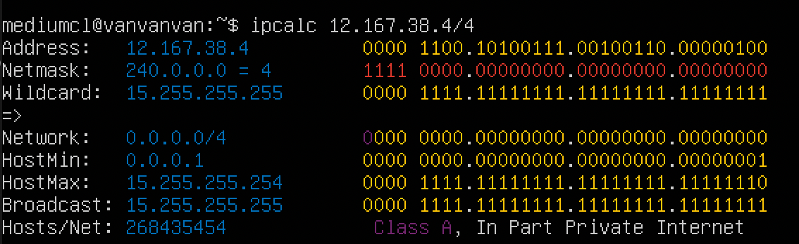
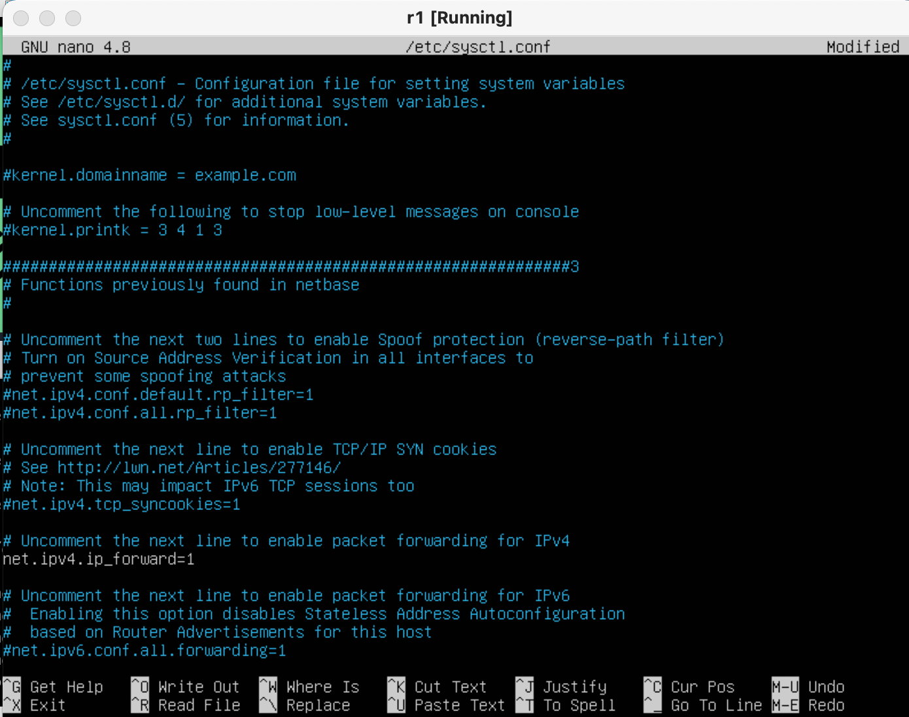
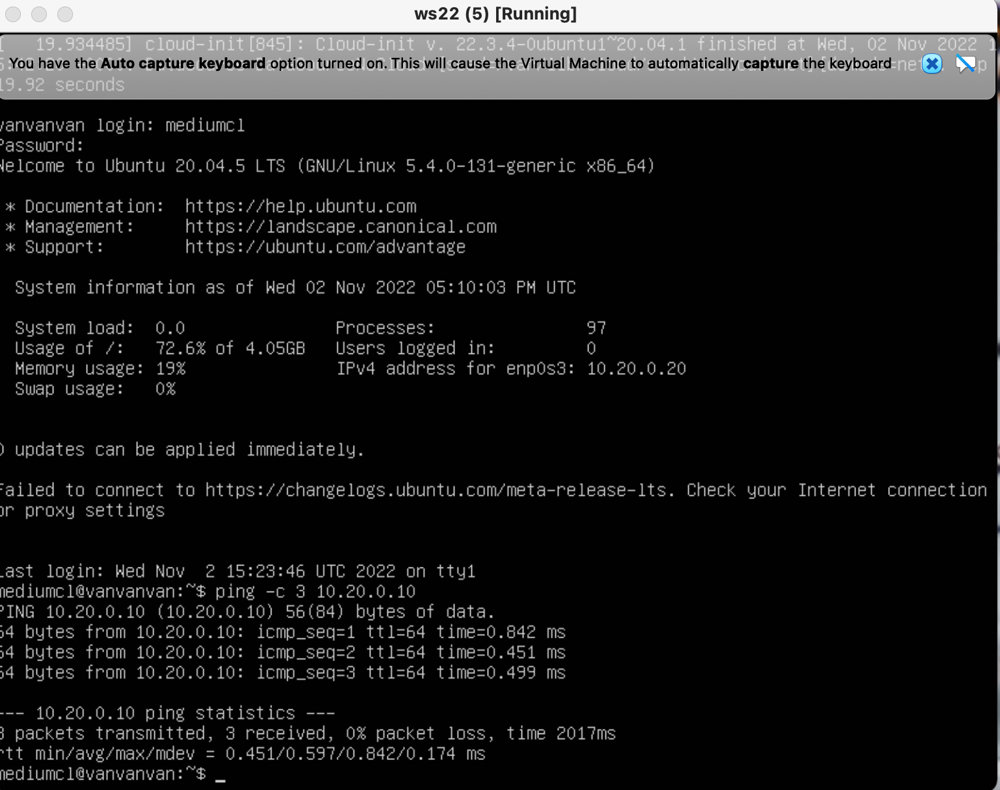
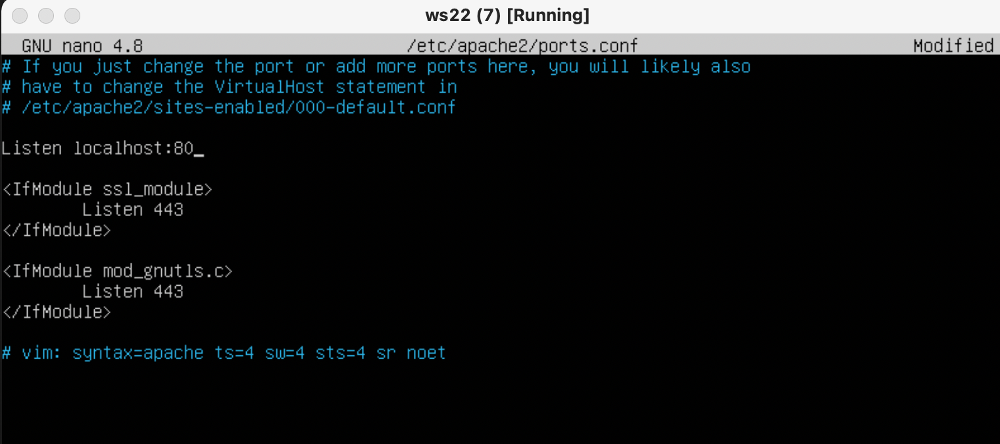

## Сети Linux/LinuxNetwork.

## Part 1. Инструмент **ipcalc**

-  **Машина создана с нужным именем**

- ### **1.1: Сети и маски**
- **установка ipcalc**

  

- ### **1.1.1 Адрес сети:** *192.167.38.54/13*
 *Результат работы команды ipcalc по этим данным* 

- ### **1.1.2 Перевод маски 255.255.255.0 в префиксную и двоичную запись, /15 в обычную и двоичную, 11111111.11111111.11111111.11110000 в обычную и префиксную:**

  Перевод маски: 255.255.255.0

*Отображение в консоли*

 - **Префиксная запись:** 24
 - **Двоичная запись:** 11111111.11111111.11111111.00000000

     Перевод прeфиксной записи: /15

- **Обычная запись:** 255.254.0.0
- **Двоичная запись:** 11111111.11111110.00000000.00000000

     Перевод бинарной записи; 11111111.11111111.11111111.11110000:

**Здесь уже придется считать вручную и без скринов**

- **Прeфикс**: /28 (Количество активных едениц подряд)
- **Маска**: 255.255.255.240 (Что соответствует прификсу /28)
  

- ### **1.1.3: Минимальный и максимальный хост в сети *12.167.38.4* при масках:** 
 
- */8*:

- **HostMin:** 12.0.0.1 
- **HostMax:** 12.255.255.254
 

- */11111111.11111111.00000000.00000000*:

Если переводить в десятичную запись, то маска выглядит следующим образом: 255.255.0.0

- **HostMin:** 12.167.0.1 
- **HostMax:** 12.167.255.254
 

- */255.255.254.0*:

- **HostMin:** 12.167.38.1 
- **HostMax:** 12.167.39.254
 

- */4*:

- **HostMin:** 0.0.0.1 
- **HostMax:** 15.255.255.254
 

- ### **1.2: Localhost. Определить и записать в отчёт, можно ли обратиться к приложению, работающему на localhost, со следующими IP: 194.34.23.100, 127.0.0.2, 127.1.0.1, 128.0.0.1:** 
 

- **Минимальный доступный адрес locahost:** - 127.0.0.1

 **Адрес имеет класс A, следовательно его маска по умолчанию :** /8

 **Нам доступен диапозон :** 
 **Min:** 127.0.0.1 
 **Max:** 127.255.255.254

 **Под наши цели подойдут следующие ip-адреса :** 127.0.0.2 , 127.1.0.1
 

 - ### **1.3. Диапазоны и сегменты сетей:** 
 

- ### **1.3.1 Какие из перечисленных IP можно использовать в качестве публичного, а какие только в качестве частных: 10.0.0.45, 134.43.0.2, 192.168.4.2, 172.20.250.4, 172.0.2.1, 192.172.0.1, 172.68.0.2, 172.16.255.255, 10.10.10.10, 192.169.168.1:** 
 

 **Только частные адреса:** 10.0.0.45 , 192.168.4.2 , 172.20.250.4 , 172.16.255.255 , 10.10.10.10
 **Адреса, которые могут быть публичными:** 134.43.0.2 , 172.0.2.1 , 192.172.0.1 , 172.68.0.2 , 192.169.168.1

 

- ### **1.3.2 Какие из перечисленных IP адресов шлюза возможны у сети 10.10.0.0/18: 10.0.0.1, 10.10.0.2, 10.10.10.10, 10.10.100.1, 10.10.1.255:** 
 

- **Узнаем min и max для этой сети:**

**Нам доступен диапозон :** 
 **Min:** 10.10.0.1 
 **Max:** 10.10.63.254

**Под наши цели подойдут следующие ip-адреса :** 10.10.100.1 и 10.0.0.1

## Part 2. Статическая маршрутизация между двумя машинами

- **Поднять две виртуальные машины (далее -- ws1 и ws2) и с помощью команды ip a посмотреть существующие сетевые интерфейсы** 
 

- **Описать сетевой интерфейс, соответствующий внутренней сети, на обеих машинах и задать следующие адреса и маски: ws1 - `192.168.100.10, маска /16`, ws2 - `172.24.116.8, маска /12`** 
 

- **Редактируем соответствующие файлы в netplan на каждой машине**

 

- **Выполнить команду `netplan apply` для перезапуска сервиса сети**

 

- ### **2.1. Добавление статического маршрута вручную**
 

- **Добавить статический маршрут от одной машины до другой и обратно при помощи команды вида `ip r add`**
 

- **Используем команду `sudo ip r add [нужный ip] dev enp0s3` на каждой машние и пингуем их**
Для первой машины используем ip второй и наоборот.

- ### **2.2. Добавление статического маршрута с сохранением.**

- **Ребутаем машины**
 

 

- **Меняем файл etc/netplan/00-installer-config.yaml на обеих машинах**
 

- **Пингуем**
 

 

## Part 3. Утилита **iperf3**

- ### **3.1. Скорость соединения**
 
Перевести и записать в отчёт: 8 Mbps в MB/s, 100 MB/s в Kbps, 1 Gbps в Mbps
 

`8 Mbps` = `1 MB/s`
`100 MB/s` = `819200 Kbps`
`1 Gbps` = `1024 Mbps`

- ### **3.2. Утилита iperf3**
 

- **Для того, чтобы проверить скорость соединения c помощью `iperf3` нужно сделать одну машину сервером(ws1), а другую клиентом (ws2)**
 

- **Устанавливаем на обе машины ipef3 с помощью команды `sudo apt install iperf3`**
 

- **Используем команду `iperf3 -s` на машине которая будет сервером**
 

- **После определения машины-сервера используем команду `iperf3 -c [ip машины -сервера]` на клиентской машине**
 

- *Результаты на скриншоте*

## Part 4. Сетевой экран
 

- ### **4.1. Утилита iptables**
 

Создать файл `/etc/firewall.sh`, имитирующий фаерволл, на ws1 и ws2:

` #!/bin/sh`

` # Удаление всех правил в таблице "filter" (по-умолчанию). `
` iptables –F `
` iptables -X `

- **Нужно добавить в файл подряд следующие правила:**

1) на ws1 применить стратегию когда в начале пишется запрещающее правило, а в конце пишется разрешающее правило (это касается пунктов 4 и 5)

2) на ws2 применить стратегию когда в начале пишется разрешающее правило, а в конце пишется запрещающее правило (это касается пунктов 4 и 5)

3) открыть на машинах доступ для порта 22 (ssh) и порта 80 (http)

4) запретить echo reply (машина не должна "пинговаться”, т.е. должна быть блокировка на OUTPUT)

5) разрешить echo reply (машина должна "пинговаться")

- **Запустить файлы на обеих машинах командами `chmod +x /etc/firewall.sh` и `/etc/firewall.sh`**

- ### **4.2. Утилита `nmap`**
 

- **Устанавливаем утилиту `nmap`**
 

- **Командой ping найти машину, которая не "пингуется", после чего утилитой nmap показать, что хост машины запущен**
 

- Не пингуется машина с ip 192.168.100.10 (ws1)
 

- Порты для подключения к 192.168.100.10 закрыты.
 

## Part 5. Статическая маршрутизация сети

- Поднять пять виртуальных машин (3 рабочие станции (ws11, ws21, ws22) и 2 роутера (r1, r2))

 

- ### **5.1. Настройка адресов машин**

 

- Настроить конфигурации машин в etc/netplan/00-installer-config.yaml согласно сети на рисунке в задании.
- Создав все машины, мы редактируем netplan через *nano*.
- Далее применяем команду *sudo netplan apply* что бы изменения вступили в силу.
- Выключаем машины и внастройках виртуал бокс добавляем по одному одаптеру к роутерам. Это неоюходимо для коректной работы доплонительных сетевых карт.
- Проверяем все сделаное.

 

- **Результат настройки машин**
- **ws11.**
 

- **r1.**
 

- **ws21.**
 

- **ws22.**
 

- **r2.**
 

 

- **Пингуем ws11 с r1**

 

- **Пингуем ws21 с ws22**

- ### **5.2. Включение переадресации IP-адресов.**

- **Применяем команду `sysctl -w net.ipv4.ip_forward=1` на роутерах**
 

- **Результат работы на r1.**

- **Результат работы на r2.**

- **Открывем файл `/etc/sysctl.conf ` и добавляем в него строку ` net.ipv4.ip_forward = 1`**

- **Результат редактирования на r1.**

- **Результат редактирования на r2.**

- ### **5.3. Установка маршрута по-умолчанию.**

- **Меняем настройки netplan на каждой машине ws и сразу смотрим результаты**

- **Вызвать ip r и показать, что добавился маршрут в таблицу маршрутизации**

- **Пропинговать с ws11 роутер r2 и показать на r2, что пинг доходит. Для этого использовать команду:** `tcpdump -tn -i eth1`

- ### **5.4. Добавление статических маршрутов.**

- **Добавить в роутеры r1 и r2 статические маршруты в файле конфигураций.**

- **Вызвать `ip r` и показать таблицы с маршрутами на обоих роутерах. Пример таблицы на r1 и r2:**

- **Запустить команды на ws11:**

`ip r list 10.10.0.0/[маска сети]`
`ip r list 0.0.0.0/0`

Для адреса 10.10.0.0/[порт сети] был выбран маршрут, отличный от 0.0.0.0/0, потому что маска /18 описывает маршрут к сети точнее, в отличие от маски /0

- ### **5.5. Построение списка маршрутизаторов.**

- **Запустить на r1 команду:** `tcpdump -tnv -i eth0` 
- **При помощи утилиты traceroute построить список маршрутизаторов на пути от ws11 до ws21:**
 

Спустя более 10 часов страданий в попытках правильно сделать данный пункт задания, переписывая множество раз netplan, переустанавливая машины, и переписывая firewall, всё-таки удалось получить нужный результат. А теперь вернемся к сути.

- **Принцип работы traceroute:**

Для определения промежуточных маршрутизаторов traceroute отправляет серию пакетов данных целевому узлу, при этом каждый раз увеличивая на 1 значение поля TTL («время жизни»). Это поле обычно указывает максимальное количество маршрутизаторов, которое может быть пройдено пакетом. Первый пакет отправляется с TTL, равным 1, и поэтому первый же маршрутизатор возвращает обратно сообщение ICMP, указывающее на невозможность доставки данных. Traceroute фиксирует адрес маршрутизатора, а также время между отправкой пакета и получением ответа (эти сведения выводятся на монитор компьютера). Затем traceroute повторяет отправку пакета, но уже с TTL, равным 2, что позволяет первому маршрутизатору пропустить пакет дальше.

Процесс повторяется до тех пор, пока при определённом значении TTL пакет не достигнет целевого узла. При получении ответа от этого узла процесс трассировки считается завершённым.

- ### **5.6. Построение списка маршрутизаторов.**

- **Запустить на r1 перехват сетевого трафика, проходящего через eth0 с помощью команды:**
`tcpdump -n -i eth0 icmp`
- **Пропинговать с ws11 несуществующий IP (например, *10.30.0.111*) с помощью команды:**
`ping -c 1 10.30.0.111`

 

## Part 6. Динамическая настройка IP с помощью **DHCP**

- **Для r2 настроить в файле /etc/dhcp/dhcpd.conf конфигурацию службы DHCP:**
 

- **1) указать адрес маршрутизатора по-умолчанию, DNS-сервер и адрес внутренней сети.**

Устанавливаем DHCP сервер командой `sudo apt-get install isc-dhcp-server`

- **2) в файле *resolv.conf* прописать `nameserver 8.8.8.8.`**

- **Перезагрузить службу DHCP командой systemctl restart isc-dhcp-server. Машину ws21 перезагрузить при помощи reboot и через ip a показать, что она получила адрес. Также пропинговать ws22 с ws21.**

 - **Вывод команды `ip a` на ws21**
 

 - **Пинг с ws22 к ws21**

 - **Указать MAC адрес у ws11, для этого в `etc/netplan/00-installer-config.yaml` надо добавить строки: `macaddress: 10:10:10:10:10:BA`, `dhcp4: true`**

 

  - **Для r1 настроить аналогично r2, но сделать выдачу адресов с жесткой привязкой к MAC-адресу (ws11). Провести аналогичные тесты**
  - `/etc/dhcp/dhcpd.conf` для машины r1
   
  - `/etc/resolv.conf` для машины r1
   
  - Перезагрузка службы DHCP командой `systemctl restart isc-dhcp-server` на r1 и reboot ws11.
   
  - `ip a` на ws11
   

   - **Запросить с ws21 обновление ip адреса**

  -  `ip a` на ws21 до
  
  -  `ip a` на ws21 после
  

- `dhclient -r` для сброса текущего адреса
- `dhclient -v` для получения нового адреса

## Part 7. **NAT**

`sudo apt install apache2`

##### В файле */etc/apache2/ports.conf* на ws22 и r1 изменить строку `Listen 80` на `Listen 0.0.0.0:80`, то есть сделать сервер Apache2 общедоступным
 

- **ws22**

 

- **r1**

- **Запустить веб-сервер Apache командой `service apache2 start` на ws22 и r1**

- **ws22**

 

- **r1**

- **Добавить в фаервол, созданный по аналогии с фаерволом из Части 4, на r2 следующие правила:**
- **1) Удаление правил в таблице filter - `iptables -F`**
- **2) Удаление правил в таблице "NAT" - `iptables -F -t nat`**
- **3) Отбрасывать все маршрутизируемые пакеты - `iptables --policy FORWARD DROP`**

- **Запускаем firewall**

- **Проверить соединение между ws22 и r1 командой `ping`**

Не успех!

**Добавить в файл ещё одно правило**
- **4) Разрешить маршрутизацию всех пакетов протокола ICMP**
**Запускать файл также, как в Части 4**

- **Проверить соединение между ws22 и r1 командой `ping`**

Успех!

**Добавить в файл ещё два правила:**
- **5) Включить SNAT, а именно маскирование всех локальных ip из локальной сети, находящейся за r2 (по обозначениям из Части 5 - сеть 10.20.0.0)**
- **6) Включить DNAT на 8080 порт машины r2 и добавить к веб-серверу Apache, запущенному на ws22, доступ из вне сети**

**Запускаем**

*Перед тестированием рекомендуется отключить сетевой интерфейс **NAT** (его наличие можно проверить командой `ip a`) в VirtualBox, если он включен*

- **Проверить соединение по TCP для SNAT, для этого с ws22 подключиться к серверу Apache на r1 командой:**

`telnet [адрес] [порт]`

- **Проверить соединение по TCP для **DNAT**, для этого с r1 подключиться к серверу Apache на ws22 командой `telnet` (обращаться по адресу r2 и порту 8080)**

## Part 8. Дополнительно. Знакомство с **SSH Tunnels**
 

**Запустить на r2 фаервол с правилами из Части 7**

**Запустить веб-сервер **Apache** на ws22 только на localhost (то есть в файле */etc/apache2/ports.conf* изменить строку `Listen 80` на `Listen localhost:80`)**

**Воспользоваться *Local TCP forwarding* с ws21 до ws22, чтобы получить доступ к веб-серверу на ws22 с ws21 `ssh -L local_port:remote_ip:remote_port user@hostname`**

**Воспользоваться *Local TCP forwarding* с ws11 до ws22, чтобы получить доступ к веб-серверу на ws22 с ws11 `ssh -L local_port:remote_ip:remote_port user@hostname`**

**Для проверки, сработало ли подключение в обоих предыдущих пунктах, перейдите во второй терминал (например, клавишами Alt (option на Mac OS) + F2) и выполните команду: `telnet 127.0.0.1 [локальный порт]`**

